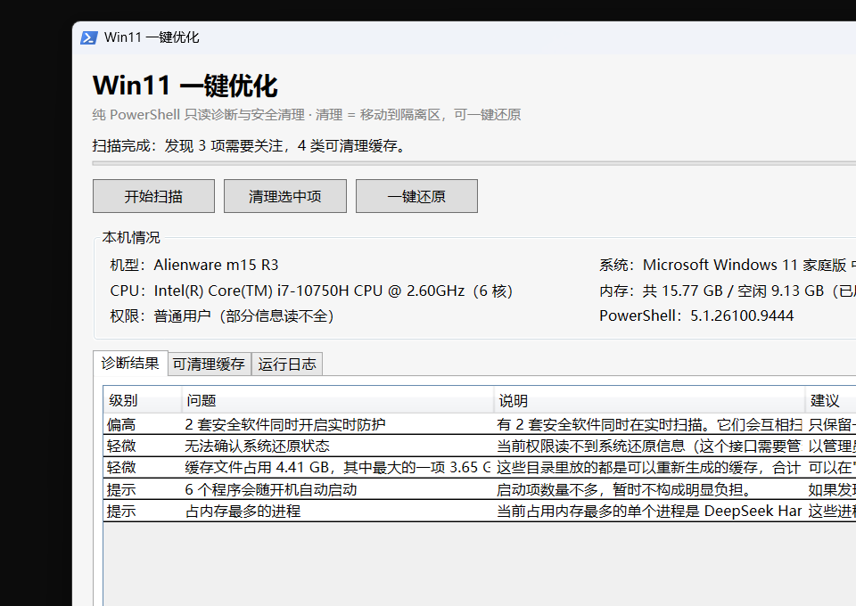

# Win11-Optimizer

[](https://github.com/ice7zero777/Win11-Optimizer/actions/workflows/ci.yml)
[](LICENSE)
[](#需求)

用纯 PowerShell 写的 Windows 11 诊断与优化工具，面向用了几年没怎么优化过、也不想为此学运维的普通用户。

- **图形界面**：双击就是窗口，点按钮操作，不用碰命令行。
- **轻量**：不用安装，下载解压双击即用，不需要 Python 或任何运行库，不常驻后台，不联网。
- **诊断**：扫描磁盘空间、内存占用、厂商服务、开机启动项、杀毒软件冲突、电源方案，用大白话给出带实测数据的报告。
- **可选清理**：清理零风险的缓存类文件（临时文件、着色器缓存、更新缓存、开发包缓存）。清理不是删除——文件被**移动到隔离区**，随时可以一键还原。
- **不乱动你的系统**：不改注册表、不改服务、不卸载软件、不碰用户文档。

> 项目动机：把一次真实的人工优化流程（扫描 → 勾选 → 可还原执行）做成普通人敢点的工具。

**状态：v1.1 已发布。** 带图形界面；默认只诊断，清理必须你勾选并确认。详见[项目状态](#项目状态)。

---

## 它解决什么问题

下面这些情况在一台用了几年、几乎没优化过的 Win11 机器上都真实出现过。它们的共同点是：进程名看不懂，也没有任何软件会主动提示。

| 现象 | 实情 |
|---|---|
| 开机慢、持续卡顿 | Dell 后台进程 `ServiceShell.exe` 占用 1797 MB 内存，戴尔官方已确认的内存泄漏缺陷 |
| 磁盘长期满载 | 三套杀毒软件同时实时扫描（Defender + 微软电脑管家 + 360 残留） |
| 特定场景卡顿 | 电源方案被后台计划任务改回第三方方案，CPU 被限频 |
| Steam 反复报错 | hosts 被加速器塞入 47 条记录，把 47 个域名（含 15 个 Steam 域名）指向 `127.0.0.1` |
| C 盘常年飘红 | 仅剩 27.70 GB（13.5%），低于 15% 时 Windows 会明显变慢 |

同一台机器手工处理前后的对比：

| 指标 | 处理前 | 处理后 |
|---|---|---|
| 内存空闲 | 4.62 GB | 9.99 GB |
| 第三方常驻服务 | 22 个 | 5 个 |
| C 盘可用 | 27.70 GB（13.5%） | 41.73 GB |
| E 盘可用 | 403.60 GB | 622.55 GB |
| 同时运行的安全软件 | 3 套 | 1 套 |

以上数字是单机实测结果，来自一次完整的人工优化，**不是本工具产出的**。那次能做成靠的是每一步都有人盯着并手工确认；这个项目想把它变成普通人也敢点的流程。

---

## 安全设计

工具会修改服务启动类型、计划任务、电源方案这类系统设置，所以安全机制全部前置，不依赖"使用时小心"。完整说明见 [docs/safety-model.md](docs/safety-model.md)。

- 只用白名单：可清理的路径写死在插件元数据里，不使用"排除掉重要的、剩下都删"的排除法。
- 不静默失败：错误必须被捕获并说明发生了什么、可能的原因、怎么补救，不允许把失败当成功。
- 外部调用带超时：所有外部进程调用都有硬超时与强制终止，避免脚本卡死。
- 改前先快照：每次改动前落盘快照，运行结束生成 `Restore-All.ps1`，支持 `-WhatIf` 演练、`-List` 查看、`-Only <插件>` 单独还原。（未实现）
- 按风险分级：零风险项默认勾选，中高风险默认不勾且需展开才可见，高风险需二次确认。标准见 [docs/risk-classification.md](docs/risk-classification.md)。

以下事情永久不做，相关功能请求不会被接受：删除或移动用户数据文件、注册表"一键清理"、自动修改网络配置（重置 Winsock 或 DNS）、自动卸载软件、自动升级驱动与固件、上传任何用户数据、插件引用外部下载的工具（必须离线可用）。大于 100 MB 的删除不在此列，但必须由你单独确认。

---

## 项目状态

| 模块 | 状态 |
|---|---|
| **图形界面**：本机信息 / 开始扫描 / 结果表格 / 勾选缓存 / 确认清理 / 一键还原 | 已完成（v1.1） |
| **诊断（默认行为）**：磁盘空间 / 内存 / 厂商服务 / 开机启动项 / 杀毒软件冲突 / 系统还原 / 电源方案 | 已完成 |
| **可选清理 + 一键还原**：白名单缓存清理、隔离区、`Restore-All.ps1`、`-Restore` | 已完成（v1.0） |
| **命令行版**：`Win11Optimizer.ps1`（只诊断 / `-Clean` / `-Restore`） | 已完成，GUI 与它共用同一套 lib |
| 铁律检查器：L1–L5 静态检查 + 36 个 Pester 用例 | 已完成，本地门禁与 GitHub Actions 全绿 |
| 需要重启或影响功能的调整（服务改手动、启动项、DISM 组件清理） | 未实现——刻意不做 |

里程碑按 [docs/PRD.md](docs/PRD.md) 的编号推进：

- **M1** 引擎骨架：契约、日志、预检、快照 —— 已落地（以 `lib/` 形式实现，快照即隔离区）
- **M2** 首批插件：磁盘 3 个、服务 2 个、启动项 2 个 —— 磁盘类已落地（只清理零风险缓存）；服务与启动项仍只报告
- **M3** 安全加固：白名单校验、危险命令拦截、还原脚本 —— 白名单与还原脚本已完成；危险命令拦截由铁律检查器在 CI 层承担
- **M4** 体验打磨：界面、三段式文案、报告渲染 —— 图形界面与 Markdown 报告已完成
- **M5** 补齐全部 15 个诊断模块 —— 已覆盖 5 类
- **M6** 文档、CI、社区模板 —— 已完成
- **M7** 图形界面 —— 已完成（v1.1，用 .NET 内置 WPF，未引入任何第三方依赖）

> 清理边界是刻意的：只做"删了会自动重建"的零风险缓存。任何需要改服务、改注册表、
> 需要重启的操作都不在这个版本里——那类功能要等更完整的预检与恢复能力。

---

## 需求

| 项目 | 要求 |
|---|---|
| 操作系统 | Windows 11（21H2 / build 22000 及以上）。不支持 Windows 10 |
| PowerShell | 5.1（系统自带）或 7+。5.1 必须能跑通 |
| Pester | 5.x，仅参与开发、跑测试套件时需要（4.x 不支持 `New-PesterConfiguration`） |
| 权限 | 只读扫描不需要管理员；用管理员运行能多读到「服务详情、安全软件、系统还原」等信息 |
| 其他依赖 | 无。不用 Python、不用运行库、不联网 |

---

## 下载即用



去 [Releases](https://github.com/ice7zero777/Win11-Optimizer/releases) 下载最新的 `Win11-Optimizer-v*.zip`，**完整解压**到任意目录，双击 `Start-Optimizer.cmd`。

会先出一个选择菜单，选 **1** 就是图形界面：点「开始扫描」看结果、在「可清理缓存」里勾选、点「清理选中项」确认，随时可以点「一键还原」放回。

> 如果 Windows 提示"已保护你的电脑"，点"更多信息 → 仍要运行"。这是因为脚本没有花钱买代码签名证书，不是病毒。工具完全离线，代码总共两千多行，你可以自己打开看。

**方式二：git clone**

```powershell
git clone https://github.com/ice7zero777/Win11-Optimizer.git
cd Win11-Optimizer
.\Start-Optimizer.cmd        # 选择菜单：1 图形界面 / 2 只读诊断 / 3 清理 / 4 还原
.\Start-Gui.cmd              # 直接开图形界面
```

**方式三：直接跑脚本**（想自己控制参数时）

```powershell
.\Win11Optimizer.Gui.ps1                              # 图形界面
.\Win11Optimizer.ps1                                  # 命令行只读诊断（需要时会请求提权）
.\Win11Optimizer.ps1 -NoElevate                       # 不提权，快速看一遍
.\Win11Optimizer.ps1 -SkipSlowScan                    # 跳过目录体积统计，更快
.\Win11Optimizer.ps1 -Clean                           # 进入清理流程（勾选 + 确认）
.\Win11Optimizer.ps1 -Clean -SelectTargets temp.user -AssumeYes   # 只清临时文件，不交互
.\Win11Optimizer.ps1 -Restore                         # 把隔离的文件放回原位
```

## 用法

**默认是只诊断**：双击后扫描 → 告诉你发现了什么 → 把报告写进 `Reports` 目录。运行完你会得到：

```
Reports/
├─ report-20261004-170957.md     # 诊断报告（用记事本或 VS Code 都能打开）
└─ Logs/scan-20261004-170957.log # 扫描日志
```

报告长这样（真实输出，节选）：

```
[偏高] 2 套安全软件同时开启实时防护
  有 2 套安全软件同时在实时扫描。它们会互相扫描对方的动作，
  这是磁盘长期 100%、风扇狂转的常见原因，而且并不会让你更安全。
  已注册的安全软件：Windows Defender（实时防护：开启）；迈克菲VirusScan（实时防护：开启）
  建议：只保留一套即可（Windows 自带的 Defender 对多数人已经够用）。
```

**它扫描这些内容**：

| 分类 | 检测项 |
|---|---|
| 磁盘 | 各分区剩余空间（含 Windows 的 15% 降速线）、可清理缓存体积、下载目录里的大文件 |
| 系统 | 内存占用与吃内存最多的进程、厂商常驻服务、开机启动项、杀毒软件冲突、系统还原、待重启状态 |
| 电源 | 当前电源方案是否被改成第三方、CPU 是否被限频、可持续性任务是否在改回方案 |

### 可选：清理缓存

清理必须显式开启，而且要先勾选、再输入 `yes` 确认：

```powershell
.\Win11Optimizer.ps1 -Clean
```

界面长这样：

```
── 可清理的缓存
   共 5 项，带 [✓] 的是默认勾选（体积达到门槛）
   [✓] 1. 当前用户临时文件        3.56 GB（362 个文件）
      另有 337.7 MB 是 3904 个小于 1 MB 的小文件，会留在原处不清。
   [ ] 2. 显卡着色器缓存          0 B（0 个文件）
      只有小文件，本次不会清理
   [✓] 3. Windows 更新下载缓存    767.0 MB（15 个文件）
   ...
   输入编号（如 1,3 或 1-3）、all 全选、回车用默认、q 放弃、d 编号看详情
```

**关键点：清理 = 移动到隔离区，不是删除。**

```
Reports/Snapshot/20261004-173519/quarantine/   ← 被移走的文件都在这里
Reports/Snapshot/Restore-All.ps1               ← 一键还原脚本
```

- 发现不对劲：跑 `.\Win11Optimizer.ps1 -Restore`，文件放回原位（原位置已有同名文件时会跳过，不覆盖）。
- 确认一切正常后：手动删掉 `Reports\Snapshot` 目录，空间才真正释放。

> 这一点很重要，别搞混：隔离**不会立刻腾出空间**（文件还在同一个盘上）。
> 实测数据：隔离 248.6 MB 后 C 盘可用反而略降；删掉隔离区后才真正回收 226.6 MB。

**它不做的事**：不改注册表、不改服务启动类型、不卸载软件、不碰桌面/文档/下载/图片等任何个人文件、不联网。

面向贡献者的开发环境准备：

```powershell
# 运行测试套件需要 Pester 5.x
Install-Module Pester -MinimumVersion 5.0 -Scope CurrentUser -Force

# 铁律检查器需要安装到浅路径（深路径下模块加载会失败）
$dest = Join-Path $env:USERPROFILE 'Documents\WindowsPowerShell\Modules\IronLaw.Checker'
New-Item -ItemType Directory -Force -Path $dest | Out-Null
Copy-Item .\analyzer\IronLaw\IronLaw.Checker.psm1 $dest
Import-Module IronLaw.Checker

# 完整本地门禁：解锁定、铁律扫描、BOM 自查、Pester
.\ci\Invoke-Analysis.ps1
```

检查器只检查 `.ps1` / `.psm1` / `.psd1`。仓库里目前还没有 `plugins/` 目录，插件落地后示例会改成对插件目录的检查。

---

## 文档

| 文档 | 内容 |
|---|---|
| [docs/PRD.md](docs/PRD.md) | 需求规格：设计原则、十条铁律、15 个诊断模块、插件契约 |
| [docs/plugin-development.md](docs/plugin-development.md) | 插件开发指南与完整示例 |
| [docs/safety-model.md](docs/safety-model.md) | 安全模型：威胁模型与防护机制 |
| [docs/risk-classification.md](docs/risk-classification.md) | 风险分级标准 |
| [CONTRIBUTING.md](CONTRIBUTING.md) | 贡献指南、编码规范、PR 自检清单 |
| [SECURITY.md](SECURITY.md) | 安全政策与漏洞报告流程 |
| [CHANGELOG.md](CHANGELOG.md) | 更新日志（首个版本尚未发布） |
| [analyzer/README.md](analyzer/README.md) | 铁律检查器的实现说明 |

## 常见问题

**它会删我的东西吗？**
不会。这个版本只读扫描，一条清理命令都没有。报告里给出的都是"建议怎么做"，动手的是你自己。

**需要管理员权限吗？**
不需要也能跑。用管理员运行能多读到服务详情、杀毒软件注册信息、系统还原状态；普通权限下这些项会如实标注"读不到"，不会编造结论。

**为什么杀毒软件会拦它？**
因为脚本没有买代码签名证书（个人项目买不起），加上它会读写系统信息与缓存目录，行为上确实像清理类工具。你可以直接在记事本里打开所有 `.ps1` 文件核对——工具本体一共两千行左右，读完用不了多久。发布包本身也用 Windows Defender 扫过，未发现威胁。

**支持 Windows 10 吗？**
v1.0 不支持，见 [docs/PRD.md](docs/PRD.md) §16。

**扫描一直卡住或者报错怎么办？**
把 `Reports\Logs` 里的日志文件附在 Issue 里。日志会记录每一步的耗时和失败原因。

**清掉的东西还能拿回来吗？**
能。清理是把文件**移动**到 `Reports\Snapshot` 隔离区，不是删除。跑 `.\Win11Optimizer.ps1 -Restore` 就会放回原位。
不过要先明确：隔离本身不释放磁盘空间，要在你确认没问题之后删掉 `Snapshot` 目录，空间才真正回收。

**为什么清理时不让我一次清干净？**
两个刻意的限制：单文件小于 1 MB 的直接留在原处（省不了多少空间，不值得为它做一次文件操作）；隔离区默认上限 2 GB，达到就停（避免清理把磁盘占满）。上限可以用 `-QuarantineBudgetMB` 调整。

**能一键无人值守清理吗？**
不能，而且不会加这个功能。`-AssumeYes` 必须同时用 `-SelectTargets` 明确列出要清理的目标，否则直接拒绝执行。

**什么时候支持改服务、关启动项这类"真优化"？**
不在 v1.0 的范围内。那类操作需要改系统行为、部分还要重启，得等更完整的预检与恢复能力——顺序是刻意的：先能看清楚，再能撤回，最后才动手。

## 参与

- 报告 Bug 或提优化建议：开 Issue，模板会提示需要哪些环境信息。
- 贡献优化插件：先读 [docs/plugin-development.md](docs/plugin-development.md)。
- 提 PR 前请读 [CONTRIBUTING.md](CONTRIBUTING.md) 里的十条铁律自检清单，并确认 `.\ci\Invoke-Analysis.ps1` 通过。
- 发现安全漏洞（尤其是可能导致误删的）：走 [SECURITY.md](SECURITY.md) 的私有报告流程，不要开公开 Issue。

## 关于作者

我是计算机相关专业的在读学生。电脑用了几年越来越卡，翻了一圈"一键优化"工具，发现它们普遍的问题是：点完按钮你不知道它动了什么，出了问题也退不回去。后来我一边查资料一边用 AI 把那台电脑整理了一遍，就想到把这套流程做成工具，给有同样需求的人省点事。

项目里的十条铁律都是自己踩坑之后总结的，比如用 `SilentlyContinue` 吞掉删除失败、报告"已清理"实际一个文件都没删。所以这个项目最看重那些看起来多余的限制。目前 AI 在开发中帮了相当大一部分忙，代码质量还在慢慢提高，欢迎指出问题。觉得有用的话点个 Star；发现哪里做得不对，欢迎开 Issue，最好带上日志。

## 许可

MIT License，按"原样"提供，详见 [LICENSE](LICENSE)。
